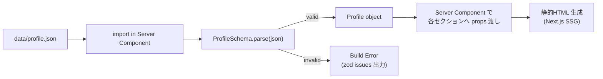
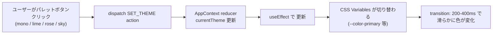
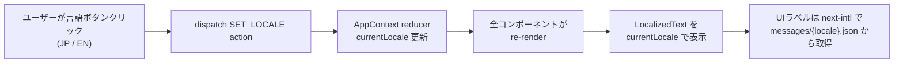
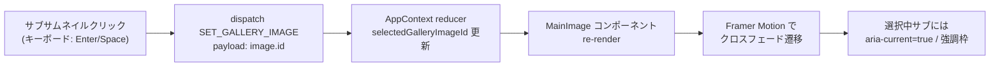
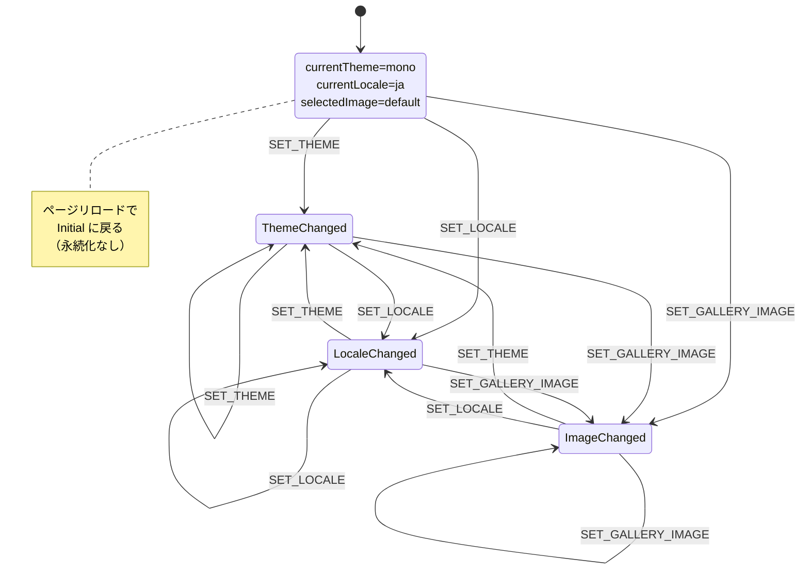

# Business Logic Model — Frontend (Self-Introduction Page)

## 概要
本ページの主要なビジネスロジックは、(1) ビルド時の `profile.json` 読み込み・検証、(2) ランタイムでのテーマ／言語／ギャラリー画像切替、(3) レスポンシブレイアウト判定、の3系統で構成される。すべてクライアントサイドで完結し、バックエンドAPIは存在しない。

---

## Logic 1: ビルド時 profile.json 読み込みフロー

**目的**: ビルド時に `profile.json` を読み込み、zod でスキーマ検証してから静的HTMLに埋め込む。



**処理ステップ**:
1. `next build` 実行時、Server Component 内で `import profileJson from '@/data/profile.json'` を実行
2. `ProfileSchema.parse(profileJson)` で zod 検証
3. 失敗時：`zod.ZodError` の issues をビルドログに整形出力してビルド停止
4. 成功時：型安全な `Profile` オブジェクトを各セクションコンポーネントに props として渡す
5. SSG により静的HTMLが生成される

---

## Logic 2: テーマ切替フロー（FR-03）

**目的**: カラーパレットボタンのクリックでページ全体のデザインカラーを即時切替する。



**処理ステップ**:
1. `<ThemePalette>` コンポーネントの `onClick` で `dispatch({ type: 'SET_THEME', payload: 'lime' })`
2. AppContext の reducer で `state.currentTheme` を更新
3. `useEffect(() => document.documentElement.dataset.theme = state.currentTheme, [state.currentTheme])`
4. `globals.css` で `[data-theme="lime"] { --color-primary: #7CFC00; ... }` が適用
5. CSS の `transition: background-color, color, border-color 250ms ease` で滑らかに変化

**永続化**: なし（FR-03-4）。リロード時に `mono`（デフォルト）に戻る。

---

## Logic 3: 言語切替フロー（FR-05）

**目的**: JP/EN ボタンのクリックで全テキストを即時切替する（ページリロードなし）。



**処理ステップ**:
1. `<LanguageSwitcher>` の `onClick` で `dispatch({ type: 'SET_LOCALE', payload: 'en' })`
2. AppContext の reducer で `state.currentLocale` を更新
3. 各コンポーネントが re-render
4. **コンテンツテキスト**（プロフィール由来）: `text[currentLocale]` で表示（例: `basic.tagline.ja`）
5. **UIラベル**（"Skills", "Career" 等）: next-intl の `t('hero.skills')` 経由で `messages/ja.json` または `messages/en.json` から取得
6. ロケール状態は AppContext と next-intl の両方で同期する（`useEffect` で next-intl 側にも反映）

**フォールバック**: 翻訳キー欠落時は `ja` のテキストを表示（business-rules.md 参照）。

---

## Logic 4: 写真ギャラリー切替フロー（FR-01-5〜8）

**目的**: ヒーロー領域のサブ画像（3枚）をクリックすると、メイン領域の画像が切り替わる。



**処理ステップ**:
1. 初期状態: `selectedGalleryImageId = gallery.find(g => g.isDefaultMain)?.id ?? gallery[0].id`
2. サブサムネイルの `onClick` / `onKeyDown(Enter|Space)` で `dispatch({ type: 'SET_GALLERY_IMAGE', payload: id })`
3. `<MainImage>` は `gallery.find(g => g.id === selectedGalleryImageId)` を表示
4. Framer Motion の `<AnimatePresence>` ＋ `motion.img` でクロスフェード（200〜300ms）
5. 選択中のサブには `aria-current="true"` と CSS の強調スタイル（枠線 / 透明度 / 拡大）

**スマホでの扱い（FR-01-8）**: 名刺レイアウト（768px未満）ではギャラリーUIを表示せず `basic.iconImagePath` を1枚表示する。

---

## Logic 5: レスポンシブレイアウト判定（FR-02）

**目的**: ビューポート幅に応じて「Web版レイアウト」と「名刺レイアウト」を切替える。

```mermaid
flowchart LR
    A["ビューポート幅"]
    A -->|>= 768px| B["Web版レイアウト<br/>(WebLayout)"]
    A -->|< 768px|  C["名刺レイアウト<br/>(BusinessCardLayout)"]
    B --> D["Hero + 写真ギャラリー<br/>+ 全セクション縦並び"]
    C --> E["名刺カード表示<br/>(写真1枚 + 名前/肩書/SNS/スキルタグ)<br/>+ 詳細セクション"]
```

**実装方針**: CSS メディアクエリで切替（JS判定によるFOUCを避ける）。
- `<HeroWeb>` は `display: block` を `@media (min-width: 768px)` で適用、それ未満では `display: none`
- `<HeroBusinessCard>` はその逆
- `WebLayout` / `BusinessCardLayout` を1つの page 内に共存させ、CSS で見せ分ける

**境界値**: 767px = 名刺、768px = Web。タブレット帯（768〜1023px）は Web版だが、グリッドのカラム数が PC（≧1024px）より少なくなる。

---

## Logic 6: スクロールアニメーション（FR-06-1）

**目的**: セクションがビューポートに入った時にフェードイン／スライドインで出現する。1度だけ実行。

**実装**: Framer Motion の `whileInView` ＋ `viewport={{ once: true }}`。
- 各セクションを `<motion.section initial={{ opacity: 0, y: 24 }} whileInView={{ opacity: 1, y: 0 }} viewport={{ once: true }}>` でラップ
- `prefers-reduced-motion: reduce` ユーザー向けに、`useReducedMotion()` を使ってアニメーション無効化

---

## Logic 7: ホバー／タップエフェクト（FR-06-2）

**目的**: リンク・ボタンの操作フィードバック。

**実装**:
- CSS の `:hover`, `:focus-visible`, `:active` で背景色・スケール・影を変化
- スマホでは `:active` または iOS の `tap-highlight-color` を活用
- フォーカス可視化（アクセシビリティ）: `:focus-visible` で 2px のアウトライン

---

## ステート遷移サマリー


