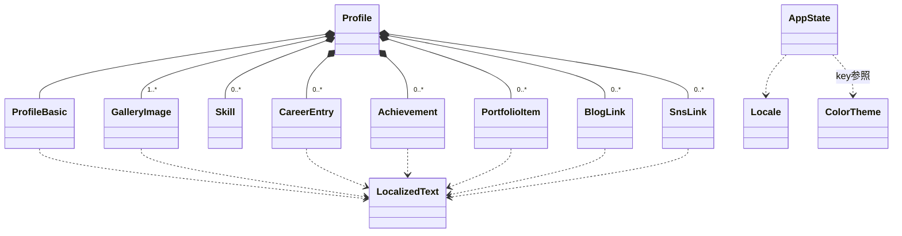

# Domain Entities — Frontend (Self-Introduction Page)

## 概要
本ページのドメインは「自己紹介ページのコンテンツ」を中心に構成される。すべてのコンテンツデータは `profile.json` に集約し、`zod` スキーマでビルド時にバリデーションする。クライアントサイドの動的状態（現在のテーマ・現在の言語・選択中のギャラリー画像）は React Context で管理する。

---

## Entity 一覧

| エンティティ | 種別 | 説明 |
|------------|------|------|
| `Profile` | コンテンツ（ルート） | profile.json 全体のルート。すべてのプロフィール情報を保持 |
| `ProfileBasic` | コンテンツ | 基本プロフィール（名前・肩書き・写真・一言メッセージ） |
| `LocalizedText` | 値オブジェクト | `{ ja: string, en: string }` 形式の多言語テキスト |
| `Skill` | コンテンツ | スキルタグ |
| `CareerEntry` | コンテンツ | 経歴エントリ |
| `Achievement` | コンテンツ | 実績エントリ |
| `PortfolioItem` | コンテンツ | ポートフォリオ作品 |
| `BlogLink` | コンテンツ | ブログ・記事リンク |
| `SnsLink` | コンテンツ | SNSリンク（GitHub / LinkedIn / Qiita 等） |
| `GalleryImage` | コンテンツ | ヒーロー領域のメイン＋サブ画像（合計4枚） |
| `ColorTheme` | 設定 | カラーテーマ定義（4色） |
| `Locale` | 値オブジェクト | `'ja' | 'en'` |
| `AppState` | クライアント状態 | 動的UIステート（現在のテーマ・言語・選択中サブ画像） |

---

## Entity 詳細

### Profile（ルートエンティティ）
`profile.json` 全体のスキーマ。

```typescript
interface Profile {
  basic: ProfileBasic;
  gallery: GalleryImage[];        // メイン1枚＋サブ複数枚（要件は計4枚）
  skills: Skill[];
  career: CareerEntry[];
  achievements: Achievement[];
  portfolio: PortfolioItem[];
  blog: BlogLink[];
  sns: SnsLink[];
}
```

### ProfileBasic
ヒーロー領域に表示する基本情報。

```typescript
interface ProfileBasic {
  name: LocalizedText;            // 名前
  title: LocalizedText;            // 肩書き
  tagline: LocalizedText;          // 一言メッセージ
  iconImagePath: string;           // 顔アイコン（スマホ名刺で使用）。例: "/images/icon.jpg"
}
```

### LocalizedText（値オブジェクト）
すべての多言語テキストはこの型で保持する。

```typescript
interface LocalizedText {
  ja: string;
  en: string;
}
```

### Skill
スキルタグ（ロケール非依存。タグ名は固有名詞扱いで両言語共通）。

```typescript
interface Skill {
  id: string;                      // 一意キー
  name: string;                    // 例: "TypeScript", "AWS"
  category?: 'language' | 'framework' | 'cloud' | 'tool' | 'design' | 'other';
}
```

### CareerEntry

```typescript
interface CareerEntry {
  id: string;
  startDate: string;               // ISO 8601 (YYYY-MM)
  endDate: string | null;          // null = 現在進行中
  organization: LocalizedText;     // 組織名
  role: LocalizedText;             // 役職
  description: LocalizedText;      // 説明
}
```

### Achievement

```typescript
interface Achievement {
  id: string;
  date: string;                    // ISO 8601
  title: LocalizedText;
  description: LocalizedText;
}
```

### PortfolioItem

```typescript
interface PortfolioItem {
  id: string;
  title: LocalizedText;
  summary: LocalizedText;
  thumbnailPath: string;            // 例: "/images/portfolio/xxx.jpg"
  url: string;                     // 外部リンクURL
  tags?: string[];                 // 関連スキル/技術タグ
}
```

### BlogLink

```typescript
interface BlogLink {
  id: string;
  title: LocalizedText;
  platform: 'zenn' | 'qiita' | 'medium' | 'note' | 'devto' | 'other';
  publishedDate: string;           // ISO 8601
  url: string;
}
```

### SnsLink

```typescript
interface SnsLink {
  id: string;
  platform: 'github' | 'linkedin' | 'qiita' | 'zenn' | 'x' | 'other';
  label: LocalizedText;            // ツールチップ等で使う表示名
  url: string;
  // アイコンは platform 値から react-icons の対応コンポーネントへマッピング
}
```

### GalleryImage
ヒーロー領域の画像。配列の先頭がデフォルトのメイン画像、残りがサブとして並ぶ。

```typescript
interface GalleryImage {
  id: string;
  path: string;                    // public/images/ 配下のパス
  alt: LocalizedText;              // alt テキスト
  isDefaultMain?: boolean;         // 初期表示時にメインに置く画像（1つだけ true）
}
```

### ColorTheme（設定ファイル側で定義）
profile.json には含めず、コード内の TypeScript 定数として定義する（要件 NFR-03-2）。

```typescript
interface ColorTheme {
  key: 'mono' | 'lime' | 'rose' | 'sky';
  name: string;                    // 表示名（"Black", "Shiun San" など）
  // CSS Variables にバインドされる役割色
  colors: {
    primary: string;               // アクセントカラー（テーマ色）
    background: string;            // 背景色
    surface: string;               // カード/セクション背景
    text: string;                  // 本文テキスト
    textMuted: string;             // 補助テキスト
    border: string;                // 枠線
  };
  isDefault?: boolean;             // mono = true
}
```

### Locale

```typescript
type Locale = 'ja' | 'en';
```

### AppState（クライアント状態 — Context管理）

```typescript
interface AppState {
  currentTheme: ColorTheme['key']; // 'mono' | 'lime' | 'rose' | 'sky'
  currentLocale: Locale;           // 'ja' | 'en'
  selectedGalleryImageId: string;  // メインに表示中の画像ID
}

type AppAction =
  | { type: 'SET_THEME'; payload: ColorTheme['key'] }
  | { type: 'SET_LOCALE'; payload: Locale }
  | { type: 'SET_GALLERY_IMAGE'; payload: string };
```

**永続化なし**: ページリロード時はデフォルト値（`mono` / `ja` / `isDefaultMain` の画像）に戻る。

---

## profile.json のサンプル構造

```json
{
  "basic": {
    "name":    { "ja": "山田 太郎",       "en": "Taro Yamada" },
    "title":   { "ja": "ソフトウェアエンジニア", "en": "Software Engineer" },
    "tagline": { "ja": "コードで世界を…", "en": "Code the world…" },
    "iconImagePath": "/images/icon.jpg"
  },
  "gallery": [
    { "id": "g1", "path": "/images/gallery/main.jpg",  "alt": { "ja": "メイン",  "en": "Main"  }, "isDefaultMain": true },
    { "id": "g2", "path": "/images/gallery/sub-1.jpg", "alt": { "ja": "登壇",    "en": "Talk"  } },
    { "id": "g3", "path": "/images/gallery/sub-2.jpg", "alt": { "ja": "デスク",  "en": "Desk"  } },
    { "id": "g4", "path": "/images/gallery/sub-3.jpg", "alt": { "ja": "趣味",    "en": "Hobby" } }
  ],
  "skills": [
    { "id": "s1", "name": "TypeScript", "category": "language" },
    { "id": "s2", "name": "Next.js",    "category": "framework" }
  ],
  "career": [
    {
      "id": "c1",
      "startDate": "2020-04",
      "endDate": null,
      "organization": { "ja": "Acme株式会社", "en": "Acme Inc." },
      "role":         { "ja": "シニアエンジニア", "en": "Senior Engineer" },
      "description":  { "ja": "クラウドアプリ開発", "en": "Cloud app development" }
    }
  ],
  "achievements": [],
  "portfolio": [
    {
      "id": "p1",
      "title":   { "ja": "Foo OSS",   "en": "Foo OSS" },
      "summary": { "ja": "概要…", "en": "Summary…" },
      "thumbnailPath": "/images/portfolio/p1.jpg",
      "url": "https://github.com/example/foo"
    }
  ],
  "blog": [
    {
      "id": "b1",
      "title":         { "ja": "型システム入門", "en": "Type System 101" },
      "platform":      "zenn",
      "publishedDate": "2025-12-01",
      "url":           "https://zenn.dev/example/articles/xxx"
    }
  ],
  "sns": [
    { "id": "n1", "platform": "github",   "label": { "ja": "GitHub",   "en": "GitHub"   }, "url": "https://github.com/example" },
    { "id": "n2", "platform": "linkedin", "label": { "ja": "LinkedIn", "en": "LinkedIn" }, "url": "https://linkedin.com/in/example" },
    { "id": "n3", "platform": "qiita",    "label": { "ja": "Qiita",    "en": "Qiita"    }, "url": "https://qiita.com/example" }
  ]
}
```

---

## zod スキーマ（実装方針）

```typescript
// schemas/profile.ts
import { z } from 'zod';

const LocalizedTextSchema = z.object({
  ja: z.string().min(1),
  en: z.string().min(1),
});

const ProfileBasicSchema = z.object({
  name:    LocalizedTextSchema,
  title:   LocalizedTextSchema,
  tagline: LocalizedTextSchema,
  iconImagePath: z.string().min(1),
});

const GalleryImageSchema = z.object({
  id: z.string(),
  path: z.string(),
  alt: LocalizedTextSchema,
  isDefaultMain: z.boolean().optional(),
});

// ...（他エンティティ）

export const ProfileSchema = z.object({
  basic: ProfileBasicSchema,
  gallery: z.array(GalleryImageSchema).min(1),
  skills: z.array(SkillSchema),
  career: z.array(CareerEntrySchema),
  achievements: z.array(AchievementSchema),
  portfolio: z.array(PortfolioItemSchema),
  blog: z.array(BlogLinkSchema),
  sns: z.array(SnsLinkSchema),
});

export type Profile = z.infer<typeof ProfileSchema>;
```

**読み込み箇所**: Server Component（App Router）またはビルドスクリプトで `import profileJson from '@/data/profile.json'` → `ProfileSchema.parse(profileJson)` してアプリ全体で使う。失敗時はビルドエラーで停止。

---

## エンティティ間の関係



---

## トレーサビリティ（要件 → エンティティ）

| 要件 | 対応エンティティ |
|------|----------------|
| FR-01-1（基本プロフィール） | `ProfileBasic` |
| FR-01-2（スキル・経歴・実績） | `Skill`, `CareerEntry`, `Achievement` |
| FR-01-3（ポートフォリオ） | `PortfolioItem` |
| FR-01-4（ブログ） | `BlogLink` |
| FR-01-5〜8（写真ギャラリー） | `GalleryImage`, `AppState.selectedGalleryImageId` |
| FR-03（カラーテーマ） | `ColorTheme`, `AppState.currentTheme` |
| FR-04（SNS） | `SnsLink` |
| FR-05（多言語） | `LocalizedText`, `AppState.currentLocale` |
| NFR-03-1（profile.json 一元管理） | `Profile`（ルート） |
