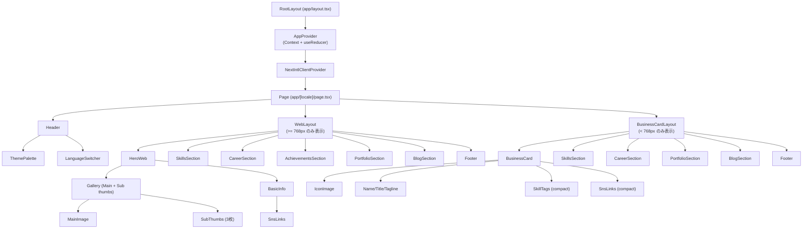
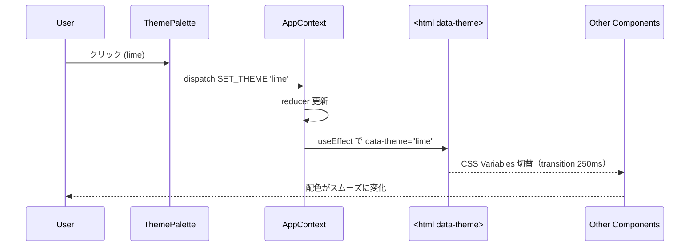
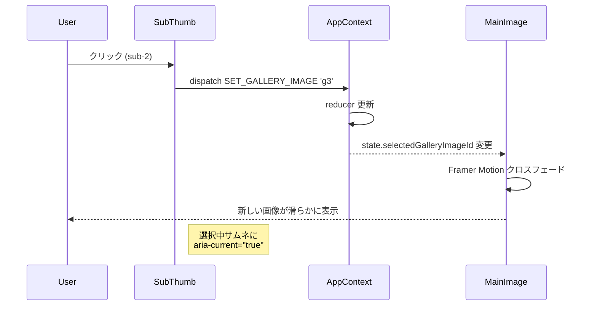

# Frontend Components — Self-Introduction Page

## 概要
Next.js 14（App Router）＋ TypeScript ＋ Tailwind CSS ＋ Framer Motion ＋ next-intl ＋ react-icons の構成。1ページ完結のSSGサイトで、ルーティングは i18n のための `[locale]` セグメントのみ。テーマと言語の状態は `AppContext`（Context + useReducer）で管理する。

---

## コンポーネント階層図



**メモ**: `WebLayout` と `BusinessCardLayout` は同じページに両方DOMマウントし、CSS メディアクエリで `display: none / block` を切替（FOUC回避）。

---

## ディレクトリ構造（予定）

```
app/
  layout.tsx                      # RootLayout（AppProvider 注入）
  [locale]/
    layout.tsx                    # NextIntlClientProvider
    page.tsx                      # ページ本体
components/
  layout/
    Header.tsx
    Footer.tsx
    WebLayout.tsx
    BusinessCardLayout.tsx
  hero/
    HeroWeb.tsx
    BasicInfo.tsx
    Gallery.tsx
    MainImage.tsx
    SubThumbs.tsx
  card/
    BusinessCard.tsx
  sections/
    SkillsSection.tsx
    CareerSection.tsx
    AchievementsSection.tsx
    PortfolioSection.tsx
    BlogSection.tsx
  controls/
    ThemePalette.tsx
    LanguageSwitcher.tsx
  common/
    SnsLinks.tsx
    IconImage.tsx
    AnimatedSection.tsx          # Framer Motion ラッパ
    LocalizedText.tsx            # text[locale] 表示ヘルパ
context/
  AppContext.tsx                 # Provider + reducer + hook
data/
  profile.json                   # コンテンツ
schemas/
  profile.ts                     # zod スキーマ
config/
  themes.ts                      # ColorTheme[] 定義（CSS変数バインド付き）
lib/
  i18n.ts                        # next-intl 設定
  contrast.ts                    # コントラスト比計算（純粋関数 → PBT対象）
  fallback.ts                    # 翻訳/画像フォールバック（純粋関数 → PBT対象）
messages/
  ja.json                        # UIラベル
  en.json
public/
  images/
    icon.jpg
    gallery/
      main.jpg
      sub-1.jpg
      sub-2.jpg
      sub-3.jpg
    portfolio/
      *.jpg
styles/
  globals.css                    # CSS Variables / [data-theme="..."] 定義
```

---

## 主要コンポーネントの Props / State

### `AppProvider`
```typescript
// 状態管理の中心。children に渡す。
function AppProvider({ children }: { children: ReactNode }): JSX.Element

// Context exposes:
interface AppContextValue {
  state: AppState;          // currentTheme, currentLocale, selectedGalleryImageId
  dispatch: Dispatch<AppAction>;
}

// 副作用: state.currentTheme 変更時に <html data-theme="..."> を更新
```

### `Header`
```typescript
function Header(): JSX.Element
// 内部に <ThemePalette /> と <LanguageSwitcher /> を配置
// Props なし（Context から取得）
```

### `ThemePalette`
```typescript
interface ThemePaletteProps {
  themes: ColorTheme[];     // config/themes.ts から渡される
}
// 4つの丸いボタンを横並びで表示。クリックで dispatch SET_THEME
// 選択中ボタンに aria-pressed="true" と強調スタイル
```

### `LanguageSwitcher`
```typescript
function LanguageSwitcher(): JSX.Element
// JP / EN ボタン。dispatch SET_LOCALE
// 選択中に aria-pressed="true"
```

### `WebLayout` / `BusinessCardLayout`
```typescript
interface LayoutProps {
  profile: Profile;         // ビルド時に zod 検証済みのオブジェクト
}
// CSS メディアクエリで表示制御
```

### `HeroWeb`
```typescript
interface HeroWebProps {
  basic: ProfileBasic;
  gallery: GalleryImage[];
  sns: SnsLink[];
}
// 左に Gallery、右に BasicInfo + SnsLinks（PCグリッド）
// タブレット幅では縦並びに変化
```

### `Gallery`
```typescript
interface GalleryProps {
  images: GalleryImage[];   // 1枚以上
}
// 内部に <MainImage /> と <SubThumbs /> を配置
// selectedGalleryImageId は Context から取得
```

### `MainImage`
```typescript
interface MainImageProps {
  image: GalleryImage;      // 現在選択中の画像
}
// next/image で表示。Framer Motion の AnimatePresence でクロスフェード
// onError で BR-4.2 のフォールバック
```

### `SubThumbs`
```typescript
interface SubThumbsProps {
  images: GalleryImage[];   // メイン以外の最大3枚
  selectedId: string;
  onSelect: (id: string) => void;
}
// 各サムネイルは <button> 要素。Enter/Space キー対応
// 選択中サムネに aria-current="true" と強調スタイル
```

### `BusinessCard`
```typescript
interface BusinessCardProps {
  basic: ProfileBasic;
  skills: Skill[];
  sns: SnsLink[];
}
// スマホ専用「リッチ名刺」: 写真1枚 + 名前/肩書/一言 + スキルタグ + SNSアイコン
// 1画面に収まるサイズで配置。下に詳細セクションが続く
```

### `SkillsSection` / `CareerSection` / `AchievementsSection` / `PortfolioSection` / `BlogSection`
```typescript
interface SectionProps<T> {
  items: T[];
}
// 0件なら null を返してセクション自体を非表示（Story 1.2/1.4 のエッジケース）
// AnimatedSection でラップしてスクロールアニメーション
```

### `SnsLinks`
```typescript
interface SnsLinksProps {
  sns: SnsLink[];
  variant?: 'inline' | 'compact';   // Web版 vs 名刺
}
// react-icons の Simple Icons から platform 値でアイコン解決
// 外部リンクは target="_blank" rel="noopener noreferrer"
```

### `AnimatedSection`
```typescript
interface AnimatedSectionProps {
  children: ReactNode;
  delay?: number;
}
// Framer Motion の motion.section で whileInView アニメ
// useReducedMotion() でアニメ無効化
```

### `LocalizedText`
```typescript
interface LocalizedTextProps {
  text: LocalizedText;
  as?: 'span' | 'p' | 'h1' | 'h2' | 'h3';
}
// currentLocale を Context から取得し、tx() で BR-3 フォールバック適用
```

---

## ユーザーインタラクションフロー





---

## API 統合（API なし）
本プロジェクトはバックエンドAPIを持たない静的サイト。すべてのデータは `data/profile.json` と `messages/{locale}.json` のビルド時取り込みで完結する。

---

## アクセシビリティ要点（NFR-02、BR-5）
- すべてのボタンは `<button>` 要素として実装（`<div onClick>` は使わない）
- 画像には `alt` 必須（GalleryImage.alt の `LocalizedText` 経由で多言語化）
- フォーカス可視化: `:focus-visible` で 2px のアウトライン（テーマ色から派生）
- `prefers-reduced-motion` で全アニメーション無効化（`useReducedMotion()`）
- `aria-pressed` / `aria-current` でトグル状態を SR に伝達
- 見出し階層: `h1` はヒーロー名前のみ、`h2` は各セクション

---

## トレーサビリティ（ストーリー → コンポーネント）

| Story | 主担当コンポーネント |
|-------|--------------------|
| 1.1 基本プロフィール | `BasicInfo`, `BusinessCard` |
| 1.1b 写真ギャラリー | `Gallery`, `MainImage`, `SubThumbs` |
| 1.2 スキル・経歴・実績 | `SkillsSection`, `CareerSection`, `AchievementsSection` |
| 1.3 ポートフォリオ | `PortfolioSection` |
| 1.4 ブログ | `BlogSection` |
| 2.1/2.3 PC・タブレット | `WebLayout` + 各セクション |
| 2.2 スマホ名刺 | `BusinessCardLayout`, `BusinessCard` |
| 3.1〜3.4 テーマ切替 | `ThemePalette`, `AppProvider`, `themes.ts`, `globals.css` |
| 4.1 SNSリンク | `SnsLinks` |
| 5.1〜5.2 言語切替 | `LanguageSwitcher`, `LocalizedText`, `messages/*.json` |
| 6.1 スクロールアニメ | `AnimatedSection` |
| 6.2 ホバー/フォーカス | 全インタラクティブ要素のCSS |

---

## コンポーネント設計の Functional Design 完了基準
- すべての要件・ストーリーに対応するコンポーネントが本ドキュメントに登場している ✓
- 各コンポーネントの Props / 責務が明確 ✓
- 状態管理（Context + useReducer）と副作用（DOM更新）の境界が明確 ✓
- アクセシビリティとフォールバックの方針が business-rules.md と整合 ✓
