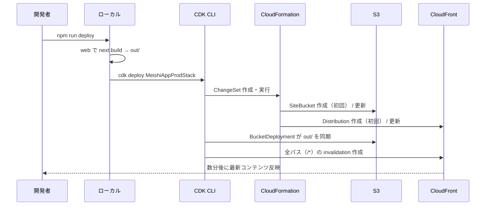

# Deployment Architecture — Frontend (Self-Introduction Page)

## 概要
本ドキュメントは、`infrastructure-design.md` で定義したスタックを実際にデプロイ・運用するための手順、前提条件、トラブルシューティングをまとめる。ROOT の `README.md` には本ドキュメントの要約版が記載される。

---

## 前提条件

### 1. ローカル環境
- Node.js 20 LTS 以上（Next.js 14 の要件）
- npm 10 以上（npm workspaces 使用）
- AWS CLI v2 インストール済み（認証確認用）
- AWS CDK CLI（`npx cdk` 経由で利用、グローバルインストール不要）
- Git

### 2. AWS アカウント
- 有効な AWS アカウント
- IAM ユーザー or IAM Role（後述の最小権限ポリシー）
- AWS 認証情報がローカルに設定済み（環境変数 / `~/.aws/credentials` / SSO）

### 3. CDK Bootstrap
対象アカウント・リージョンで CDK Bootstrap が実行済みであること（初回のみ）。

---

## デプロイフロー（フェーズ別）



---

## 初回セットアップ手順

### Step 1: AWS 認証情報の設定
```bash
aws configure
# Access Key ID / Secret Access Key / Default region (ap-northeast-1) / output (json)
```

または SSO の場合：
```bash
aws sso login --profile <profile-name>
export AWS_PROFILE=<profile-name>
```

確認：
```bash
aws sts get-caller-identity
```

### Step 2: 依存関係のインストール
```bash
# プロジェクト ROOT で
npm install
```

これで `web/` と `infra/` の両方の依存関係が npm workspaces によりインストールされる。

### Step 3: CDK Bootstrap（初回のみ）
```bash
npm run bootstrap
```

内部的には：
```bash
npx cdk bootstrap aws://<account-id>/<region>
```

これにより、CDK が利用する S3 バケット・IAM ロール等が対象アカウント・リージョンに作成される。

### Step 4: profile.json の準備
`web/data/profile.json` に自分のプロフィール情報を記入。スキーマは `web/schemas/profile.ts` の zod 定義に従う。

```bash
# 編集後に検証（zod スキーマで検証されることをローカルで確認）
npm -w web run build
```

ビルドが成功すれば profile.json は妥当。

### Step 5: 画像の配置
`web/public/images/` 配下にプロフィール写真・ギャラリー写真・ポートフォリオサムネイルを配置。

```
web/public/images/
├── icon.jpg                 # 顔アイコン（スマホ名刺用）
├── gallery/
│   ├── main.jpg             # ヒーロー領域メイン画像（PCデフォルト）
│   ├── sub-1.jpg
│   ├── sub-2.jpg
│   └── sub-3.jpg
└── portfolio/
    ├── p1.jpg
    └── ...
```

### Step 6: 初回デプロイ
```bash
npm run deploy
```

完了後、CloudFormation Outputs に表示される `DistributionDomainName`（例: `dxxxxxxxxxxxxx.cloudfront.net`）にブラウザでアクセス。**最初のデプロイは CloudFront のグローバル展開に 5〜15 分**かかることがある。

---

## 通常デプロイ手順（コンテンツ更新時）

```bash
# 1. profile.json を編集
vim web/data/profile.json

# 2. ローカル動作確認（任意）
npm -w web run dev
# → http://localhost:3000 で確認

# 3. デプロイ
npm run deploy
```

`BucketDeployment` の `distributionPaths: ['/*']` により**自動で CloudFront キャッシュ無効化**が実行されるため、追加コマンドは不要。invalidation 完了後（通常 1〜3 分）、訪問者に最新コンテンツが配信される。

---

## 差分確認・テンプレート出力

```bash
# CDK が現在の状態と何を変更するかを確認
npm -w infra run diff

# CloudFormation テンプレートのみ生成（cdk.out/ に出力）
npm run synth
```

---

## ロールバック手順

### Case 1: CDK スタックレベルのロールバック
直前の git revert → 再デプロイ：
```bash
git revert HEAD
npm run deploy
```

### Case 2: コンテンツのみロールバック
`web/data/profile.json` や画像の問題なら、git で前バージョンに戻して再デプロイ。

### Case 3: スタック完全削除
```bash
npm run destroy
```
S3バケット内のオブジェクトも削除される（`autoDeleteObjects: true`）。**dev/個人検証向けの設定**であり、prod でデータ保持が必要な場合は `removalPolicy: RETAIN` に変更。

---

## 最小 IAM 権限ポリシー（参考）

検証用途では `AdministratorAccess` でも可。本格運用するなら以下の Action を許可：

```json
{
  "Version": "2012-10-17",
  "Statement": [
    {
      "Effect": "Allow",
      "Action": [
        "cloudformation:*",
        "s3:*",
        "cloudfront:*",
        "iam:CreateRole",
        "iam:DeleteRole",
        "iam:AttachRolePolicy",
        "iam:DetachRolePolicy",
        "iam:PutRolePolicy",
        "iam:DeleteRolePolicy",
        "iam:PassRole",
        "iam:GetRole",
        "lambda:CreateFunction",
        "lambda:DeleteFunction",
        "lambda:GetFunction",
        "lambda:InvokeFunction",
        "lambda:UpdateFunctionCode",
        "lambda:UpdateFunctionConfiguration",
        "logs:CreateLogGroup",
        "logs:CreateLogStream",
        "logs:PutLogEvents",
        "ssm:GetParameter"
      ],
      "Resource": "*"
    }
  ]
}
```

実運用では Resource 句を絞り込むことが望ましい。

---

## トラブルシューティング

### `Error: This stack uses assets, so the toolkit stack must be deployed.`
→ `npm run bootstrap` 未実行。Step 3 を実行。

### `Failed to put object ... AccessDenied`
→ 認証情報が古い／権限不足。`aws sts get-caller-identity` で確認、必要なら再ログイン。

### CloudFront にアクセスして 403 が出る
→ OAC のバケットポリシー反映待ち。1〜2分待つ、またはバケット内に `index.html` が存在するか確認。

### コンテンツ更新が反映されない
→ ブラウザキャッシュ。スーパーリロード（Ctrl+Shift+R）。それでもダメなら CloudFront invalidation がまだ進行中。

### `Cannot find module '@/...'`（ビルド時）
→ `web/tsconfig.json` の paths 設定を確認。`"@/*": ["./*"]` のような設定が必要。

### Bucket 名が衝突する
→ 自動命名にしているので通常起きないが、固定名にした場合のみ発生。`bucketName` を CDK から外す（`undefined` にする）。

---

## 監視・運用（最小限）

本リリースでは個人サイトのため監視は最小限：
- CloudFront のアクセスログ — 無効（個人情報懸念とコスト）
- CloudWatch アラート — 設定なし
- S3 アクセスログ — 無効

将来必要になれば、CloudFront Real-time logs / S3 Access Logs を有効化、CloudWatch Alarm でエラー率監視を追加可能。

---

## 将来の拡張ポイント

| 拡張 | 概要 | 影響 |
|------|------|------|
| 独自ドメイン | Route 53 + ACM 証明書 + CloudFront alternate domain names | スタックに3〜4 リソース追加 |
| 環境分離（dev/prod） | `MeishiAppDevStack` を追加、context で環境切替 | bin/meishi-app.ts を拡張 |
| GitHub Actions CI/CD | プッシュで自動デプロイ | OIDC + IAM Role for GitHub Actions |
| 監視ダッシュボード | CloudWatch ダッシュボード | スタックに widgets 追加 |
| WAF | CloudFront に WAF Web ACL 紐付け | コスト増、個人サイトには過剰 |

---

## ROOT `README.md` への要約版（Code Generation で記載）

ROOT の `README.md` には以下を簡潔にまとめる：
- 前提条件（Node 20、AWS CLI、認証情報）
- セットアップ（`npm install` → `npm run bootstrap`）
- profile.json と画像の編集方法
- ローカル開発（`npm -w web run dev`）
- 本番デプロイ（`npm run deploy`）
- スタック破棄（`npm run destroy`）

詳細は本ドキュメントを参照する旨を README に記載する。
