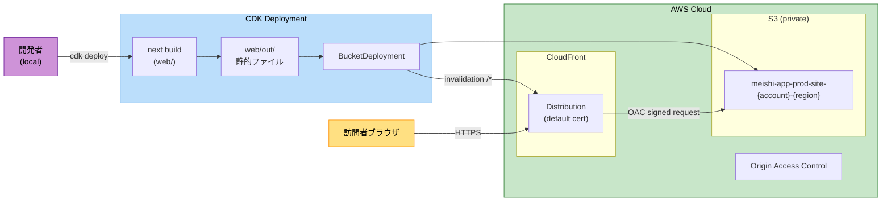

# Infrastructure Design — Frontend (Self-Introduction Page)

## 概要
本ドキュメントは、AWS S3 + CloudFront + OAC（Origin Access Control）構成を AWS CDK v2（TypeScript）で IaC 化する設計を定義する。`infra/` ディレクトリに CDK プロジェクトを配置し、`web/` の SSG 出力（`out/`）を BucketDeployment で S3 に配置、CloudFront 経由で HTTPS 配信する。

---

## 目的・スコープ
- **対象**: 静的Webサイトホスティングインフラ
- **責務**:
  - S3 バケット（プライベート）にビルド成果物を配置
  - CloudFront で HTTPS / グローバル配信 / キャッシュ
  - OAC で S3 → CloudFront のみアクセス許可
  - `npm run deploy` で1コマンドデプロイ（ビルド → アップロード → invalidation）
- **対象外**:
  - 独自ドメイン（Route 53、ACM）— 将来拡張
  - WAF、Shield — 個人サイトのため見送り
  - CI/CD（GitHub Actions等）— 手動デプロイから開始
  - マルチリージョン — CloudFront のグローバルエッジで十分

---

## 構成図



**主要トラフィック**:
1. 訪問者 → CloudFront（HTTPS）
2. CloudFront → S3（OAC 署名リクエスト、SigV4）
3. S3 → 直接アクセス禁止（バケットポリシーで CloudFront 経由のみ許可）

---

## CDK スタック設計

### スタック一覧

| スタック名 | 用途 | リソース |
|-----------|------|---------|
| `MeishiAppProdStack` | 本番環境 | SiteBucket / Distribution / OAC / BucketDeployment |

将来的に `MeishiAppDevStack` を追加可能（本リリースでは prod のみ）。

### スタック構造（疑似コード）

```typescript
// infra/lib/meishi-app-stack.ts
import * as cdk from 'aws-cdk-lib';
import { Construct } from 'constructs';
import * as s3 from 'aws-cdk-lib/aws-s3';
import * as cloudfront from 'aws-cdk-lib/aws-cloudfront';
import * as origins from 'aws-cdk-lib/aws-cloudfront-origins';
import * as s3deploy from 'aws-cdk-lib/aws-s3-deployment';
import * as iam from 'aws-cdk-lib/aws-iam';
import * as path from 'node:path';

export interface MeishiAppStackProps extends cdk.StackProps {
  envName: 'prod' | 'dev';
}

export class MeishiAppStack extends cdk.Stack {
  constructor(scope: Construct, id: string, props: MeishiAppStackProps) {
    super(scope, id, props);

    // ── S3: 静的サイトバケット（プライベート） ──
    const siteBucket = new s3.Bucket(this, 'SiteBucket', {
      bucketName: undefined, // 自動命名（衝突回避）
      blockPublicAccess: s3.BlockPublicAccess.BLOCK_ALL,
      encryption: s3.BucketEncryption.S3_MANAGED,
      enforceSSL: true,
      versioned: false,
      removalPolicy: cdk.RemovalPolicy.DESTROY,  // dev/個人用。prodで保持したい場合は RETAIN
      autoDeleteObjects: true,                    // 同上
    });

    // ── CloudFront: OAC ──
    const oac = new cloudfront.S3OriginAccessControl(this, 'OAC', {
      signing: cloudfront.Signing.SIGV4_ALWAYS,
    });

    // ── CloudFront: Distribution ──
    const distribution = new cloudfront.Distribution(this, 'Distribution', {
      defaultRootObject: 'index.html',
      defaultBehavior: {
        origin: origins.S3BucketOrigin.withOriginAccessControl(siteBucket, {
          originAccessControl: oac,
        }),
        viewerProtocolPolicy: cloudfront.ViewerProtocolPolicy.REDIRECT_TO_HTTPS,
        allowedMethods: cloudfront.AllowedMethods.ALLOW_GET_HEAD,
        cachedMethods: cloudfront.CachedMethods.CACHE_GET_HEAD,
        cachePolicy: cloudfront.CachePolicy.CACHING_OPTIMIZED,
        compress: true,
      },
      // SPA でない（純粋静的）ため SPA リダイレクトは不要
      errorResponses: [
        // 404 を index.html にフォールバックしない（ファイル単位の 404 を素直に返す）
        // ただし next export の trailing slash 慣習に応じて調整
      ],
      priceClass: cloudfront.PriceClass.PRICE_CLASS_200,  // JP/US/EU/中東/アフリカ
      httpVersion: cloudfront.HttpVersion.HTTP2_AND_3,
      minimumProtocolVersion: cloudfront.SecurityPolicyProtocol.TLS_V1_2_2021,
    });

    // ── S3 → CloudFront のみ許可するバケットポリシー（OAC連携） ──
    // CDK の S3BucketOrigin.withOriginAccessControl が自動で付与するが、明示的にも書ける
    siteBucket.addToResourcePolicy(new iam.PolicyStatement({
      actions: ['s3:GetObject'],
      resources: [siteBucket.arnForObjects('*')],
      principals: [new iam.ServicePrincipal('cloudfront.amazonaws.com')],
      conditions: {
        StringEquals: {
          'AWS:SourceArn': `arn:aws:cloudfront::${this.account}:distribution/${distribution.distributionId}`,
        },
      },
    }));

    // ── BucketDeployment: out/ を S3 に同期 + CloudFront キャッシュ無効化 ──
    new s3deploy.BucketDeployment(this, 'DeployStaticSite', {
      sources: [s3deploy.Source.asset(path.join(__dirname, '..', '..', 'web', 'out'))],
      destinationBucket: siteBucket,
      distribution,
      distributionPaths: ['/*'],
      // キャッシュ制御ヘッダ
      cacheControl: [
        s3deploy.CacheControl.maxAge(cdk.Duration.days(1)),
        s3deploy.CacheControl.sMaxAge(cdk.Duration.days(30)),
      ],
    });

    // ── 出力 ──
    new cdk.CfnOutput(this, 'DistributionDomainName', {
      value: distribution.domainName,
      description: 'CloudFront URL（このURLにアクセスしてサイト表示確認）',
    });
    new cdk.CfnOutput(this, 'SiteBucketName', { value: siteBucket.bucketName });
    new cdk.CfnOutput(this, 'DistributionId',  { value: distribution.distributionId });
  }
}
```

```typescript
// infra/bin/meishi-app.ts
import * as cdk from 'aws-cdk-lib';
import { MeishiAppStack } from '../lib/meishi-app-stack';

const app = new cdk.App();
new MeishiAppStack(app, 'MeishiAppProdStack', {
  envName: 'prod',
  env: {
    account: process.env.CDK_DEFAULT_ACCOUNT,
    region:  process.env.CDK_DEFAULT_REGION ?? 'ap-northeast-1',
  },
  description: 'Self-introduction page (prod): S3 + CloudFront + OAC',
});
```

---

## CDK パッケージ構成（`infra/`）

```
infra/
├── package.json
├── cdk.json
├── tsconfig.json
├── jest.config.js          # （任意）スタックのスナップショットテスト
├── bin/
│   └── meishi-app.ts       # エントリ
├── lib/
│   └── meishi-app-stack.ts # メインスタック
├── test/
│   └── meishi-app-stack.test.ts
└── .gitignore              # cdk.out, node_modules
```

`infra/package.json`（抜粋）:
```json
{
  "name": "infra",
  "version": "0.1.0",
  "scripts": {
    "build": "tsc",
    "watch": "tsc -w",
    "synth": "cdk synth",
    "diff": "cdk diff",
    "deploy": "cdk deploy MeishiAppProdStack --require-approval never",
    "destroy": "cdk destroy MeishiAppProdStack",
    "bootstrap": "cdk bootstrap"
  },
  "dependencies": {
    "aws-cdk-lib": "^2.150.0",
    "constructs": "^10.0.0"
  },
  "devDependencies": {
    "aws-cdk": "^2.150.0",
    "typescript": "^5.4.0",
    "ts-node": "^10.9.0",
    "@types/node": "^20.0.0"
  }
}
```

---

## ルートレベルでの統合（npm workspaces）

ROOT `package.json` で workspaces を定義し、`npm run deploy` を1コマンド化する：

```json
{
  "name": "meishi-app",
  "private": true,
  "workspaces": ["web", "infra"],
  "scripts": {
    "build:web":    "npm -w web run build",
    "build:infra":  "npm -w infra run build",
    "synth":        "npm run build:web && npm -w infra run synth",
    "deploy":       "npm run build:web && npm -w infra run deploy",
    "destroy":      "npm -w infra run destroy",
    "bootstrap":    "npm -w infra run bootstrap"
  }
}
```

これにより**ROOT直下で `npm run deploy` を実行するだけ**で：
1. `web` で `next build` 実行 → `web/out/` に静的ファイル生成
2. `infra` で `cdk deploy` 実行 → S3 同期 + CloudFront invalidation

---

## ネットワーク・セキュリティ

| 項目 | 設定 |
|------|------|
| S3 公開ACL | 全ブロック（`BLOCK_ALL`） |
| S3 バケット暗号化 | SSE-S3（AES-256） |
| S3 SSL強制 | `enforceSSL: true` |
| S3 → CloudFront | OAC（SIGV4_ALWAYS）＋ バケットポリシーで CloudFront のみ |
| CloudFront プロトコル | `REDIRECT_TO_HTTPS`、TLSv1.2_2021 |
| CloudFront 証明書 | デフォルト（`*.cloudfront.net`）— カスタムドメインは将来 |
| CloudFront 圧縮 | 有効（gzip/brotli） |
| CloudFront HTTP/2/3 | 有効 |
| Allowed Methods | `GET, HEAD` のみ |

---

## 命名規則

| リソース | 命名 |
|---------|------|
| Stack | `MeishiAppProdStack` |
| S3 Bucket | CDK 自動命名（衝突回避）。出力で実バケット名を表示 |
| CloudFront Distribution | CDK 自動命名 |
| OAC | CDK 自動命名 |
| Tag | `Project=MeishiApp`, `Env=prod`, `ManagedBy=CDK`（スタックレベルで一括付与） |

スタックレベルのタグは `bin/meishi-app.ts` で `cdk.Tags.of(stack).add(...)` を使用して一括付与する。

---

## 変更管理

| シナリオ | コマンド |
|---------|---------|
| 通常デプロイ（コンテンツ更新） | `npm run deploy`（プロジェクトROOT） |
| 構成差分プレビュー | `npm -w infra run diff` |
| CFn テンプレート生成のみ | `npm run synth` |
| スタック破棄 | `npm run destroy` |
| 初回 CDK Bootstrap | `npm run bootstrap` |

---

## 想定IAM権限（デプロイ実行ユーザー）

最低限必要な権限：
- **CloudFormation**: スタック作成・更新・削除
- **S3**: バケット作成・オブジェクト put/delete・ポリシー操作
- **CloudFront**: ディストリビューション作成・OAC作成・invalidation
- **IAM**: BucketDeployment が利用する Lambda の実行ロール作成
- **Lambda**: BucketDeployment 用の関数作成・呼び出し

開発者個人の検証用途なら `AdministratorAccess` で簡略化、本番運用なら最小権限ポリシーを別途作成。詳細は `deployment-architecture.md` 参照。

---

## NFR との対応

| NFR ID | 設計上の対応 |
|--------|------------|
| NFR-4.1 静的サイト出力 | `next.config.mjs` で `output: 'export'` |
| NFR-4.2 IaC ツール | AWS CDK v2（TypeScript）、`infra/` 配下 |
| NFR-4.3 ホスティング構成 | S3 + CloudFront + OAC（上記スタック） |
| NFR-4.4 TLS / HTTPS | CloudFront の `REDIRECT_TO_HTTPS` ＋ TLSv1.2_2021 |
| NFR-4.5 デプロイ自動化 | `npm run deploy`（workspaces 経由） |
| NFR-4.6 環境分離 | `MeishiAppProdStack` を定義。dev は将来追加可 |
| NFR-4.7 手順文書化 | ROOT `README.md`（Code Generation で初稿作成） |

---

## 想定コスト（参考）

個人サイトの規模（月間数千PV、容量数MB〜数十MB）を想定：

| サービス | 想定使用量 | 月額目安（USD） |
|---------|-----------|---------------|
| S3 | 数十MB ＋ 少量リクエスト | < $0.05 |
| CloudFront | 数GB転送 / 数千リクエスト | < $1（無料枠内のことも多い） |
| Route 53（将来） | — | $0.50 / hosted zone |
| ACM（将来） | — | 無料（CloudFront 用途） |
| **合計** | — | **〜$1/月** |

---

## デザイン完了基準
- スタックが全 NFR-4.x 要件をカバー ✓
- OAC + プライベートS3で公開アクセスを防止 ✓
- 1コマンドデプロイ（ビルド → アップロード → invalidation） ✓
- 命名規則・タグ付与を定義 ✓
- 詳細なデプロイ手順は deployment-architecture.md に分離 ✓
