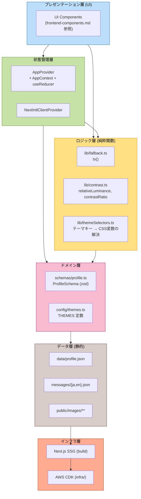
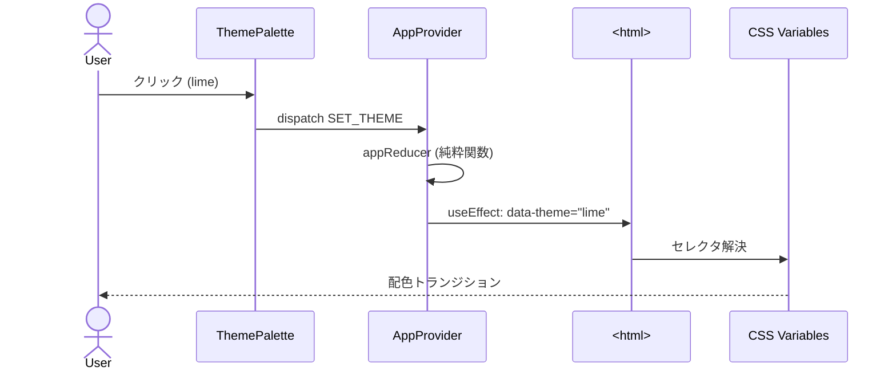
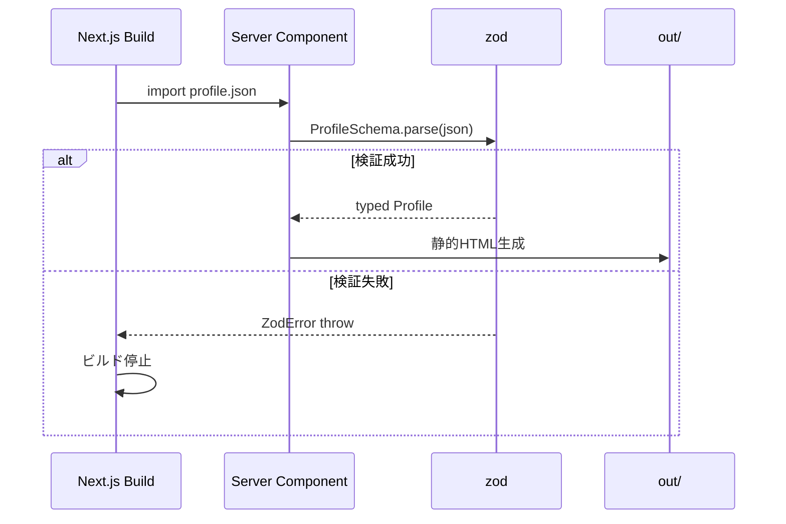
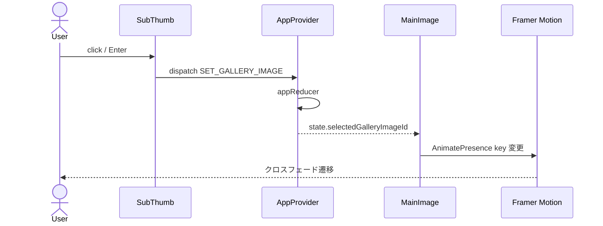

# Logical Components — Frontend (Self-Introduction Page)

## 概要
NFR Design パターン（`nfr-design-patterns.md`）を実装する論理コンポーネントの責務分担と関係を整理する。Functional Design の `frontend-components.md` がUIコンポーネント中心であるのに対し、本ドキュメントは **NFR を担う層** に焦点を当てる。

---

## レイヤー構成

---

## コンポーネント詳細

### Presentation 層（UI）
詳細は `frontend-components.md` を参照。NFR の観点では：
- **責務**: 表示・ユーザー操作の捕捉のみ（ビジネスロジックを持たない）
- **依存**: State 層（Context経由）、Logic 層の純粋関数
- **テスト**: @testing-library/react によるレンダリングテスト・操作テスト

### State 層

#### `AppProvider` / `AppContext`
- **責務**: テーマ・言語・選択画像の状態保持と更新
- **副作用**: `<html data-theme>` 更新、`document.documentElement.lang` 更新
- **永続化**: なし（要件 FR-03-4）
- **テスト**: reducer 単体テスト（純粋関数として）、Provider のレンダリングテスト

#### `NextIntlClientProvider`
- **責務**: next-intl のメッセージ配信
- **配下**: `useTranslations()` フック利用箇所
- **同期**: `AppContext.currentLocale` と双方向同期

### Logic 層（純粋関数）

#### `lib/fallback.ts`
- **`tx(text: LocalizedText, locale: Locale): string`**
  - 翻訳フォールバック（BR-3）
  - **PBT対象**: 入力に対する不変条件をテスト
    - 「ja か en の少なくとも一方が非空なら、戻り値も非空」
    - 「ja・en 両方非空なら、戻り値は locale 対応の値」

#### `lib/contrast.ts`
- **`relativeLuminance(rgb): number`** — sRGB → 相対輝度（WCAG計算）
- **`contrastRatio(fg, bg): number`** — 2色のコントラスト比
- **`hexToRgb(hex): {r,g,b}`** — `#RRGGBB` 解析
- **PBT対象**:
  - `contrastRatio(a, b) === contrastRatio(b, a)`（対称性）
  - `1 <= contrastRatio(a, b) <= 21`（範囲）
  - `contrastRatio(c, c) === 1`（同一色は1）
- **使用箇所**: テーマ定義時のテストで4テーマ全色ペアを検証

#### `lib/themeSelectors.ts`
- **`themeFromKey(key): ColorTheme | undefined`**
- **`getDefaultTheme(): ColorTheme`**
- **`getThemeKeys(): ThemeKey[]`**

### Domain 層

#### `schemas/profile.ts`
- zod スキーマ定義（domain-entities.md 参照）
- `ProfileSchema`, `ProfileBasicSchema`, etc.
- BR-1 系のバリデーションルールを `.refine()` で実装

#### `config/themes.ts`
- 4テーマの定数定義
- カラーは `globals.css` の CSS Variables 側で具体値を持ち、ここではキー・名称・デフォルトフラグのみ管理（DRY）

### Data 層
- **`data/profile.json`** — コンテンツ（NFR-3.1: 単一源）
- **`messages/{ja,en}.json`** — UIラベル
- **`public/images/`** — 画像

### Infra 層
- **Next.js SSG ビルド** — `npm run build` → `out/`
- **AWS CDK** — `infra/` （`infrastructure-design.md` で詳細化）

---

## 主要ユースケースの責務分担

### UC-1: テーマ切替

### UC-2: profile.json 検証（ビルド時）

### UC-3: ギャラリー切替

---

## 責務の境界（重要）

| やること | やらないこと |
|---------|------------|
| **Logic 層**: 純粋関数のみ。副作用なし | DOM操作、I/O、状態保持 |
| **State 層**: 状態の保持と単一の副作用境界 | 複雑な計算（Logic に委譲） |
| **Presentation 層**: 表示と操作の受付 | データ変換、ビジネスルール判定 |
| **Domain 層**: スキーマと型の定義 | データ取得・変換処理 |

この境界により：
- Logic 層は PBT でカバーレッジ高く検証可能（NFR-5.2）
- State 層の reducer は単体テストで網羅可能（NFR-5.4）
- UI コンポーネントは表示確認のみで OK（テスト軽量）

---

## NFR Design 完了基準
- 12 のパターン（P-1〜P-12）が要件 NFR-1〜6 をカバー ✓
- 各パターンに具体的な実装スケッチが付随 ✓
- 純粋関数（PBT対象）が明示されている ✓
- 責務の境界（レイヤー）が明確 ✓
- インフラ層は Infrastructure Design に委譲 ✓
