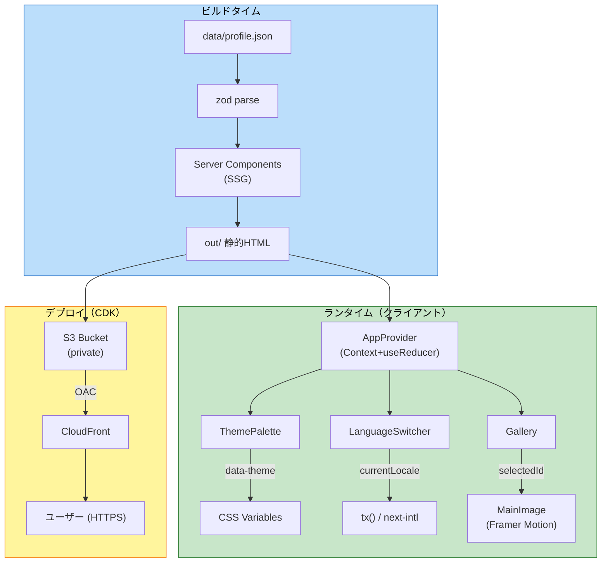

# NFR Design Patterns — Frontend (Self-Introduction Page)

## 概要
本ドキュメントは、`nfr-requirements.md` の NFR-1〜NFR-6 を実現する具体的なアーキテクチャパターン・実装パターンを整理する。

---

## P-1: テーマ切替パターン（CSS Variables + data-attribute）

**対象 NFR**: NFR-1.4（INP）, NFR-2.2（コントラスト）, NFR-3.3（テーマ追加容易性）

**パターン**:
- `:root` と `[data-theme="..."]` セレクタで CSS 変数を上書き
- `<html data-theme="lime">` 切替で全配色が同期
- transition は配色プロパティのみに限定（再描画コスト最小化）

```css
/* styles/globals.css */
:root,
[data-theme="mono"] {
  --color-primary:    #000000;
  --color-background: #ffffff;
  --color-surface:    #f5f5f5;
  --color-text:       #111111;
  --color-text-muted: #555555;
  --color-border:     #e5e5e5;
  --color-on-primary: #ffffff;
}

[data-theme="lime"] {
  --color-primary:    #7CFC00;
  --color-background: #0E1A0E;
  --color-surface:    #162616;
  --color-text:       #EAFFEA;
  --color-text-muted: #A8C8A8;
  --color-border:     #2A3A2A;
  --color-on-primary: #0E1A0E;
}

[data-theme="rose"] { /* ... */ }
[data-theme="sky"]  { /* ... */ }

* {
  transition:
    background-color 250ms ease,
    color            250ms ease,
    border-color     250ms ease,
    fill             250ms ease,
    stroke           250ms ease;
}

@media (prefers-reduced-motion: reduce) {
  * { transition: none !important; }
}
```

```typescript
// config/themes.ts
export const THEMES = [
  { key: 'mono', name: 'Black',      isDefault: true },
  { key: 'lime', name: 'Shiun San' },
  { key: 'rose', name: 'Rose Pink'  },
  { key: 'sky',  name: 'Sky Blue'   },
] as const;

export type ThemeKey = typeof THEMES[number]['key'];
```

```typescript
// AppProvider 内
useEffect(() => {
  document.documentElement.dataset.theme = state.currentTheme;
}, [state.currentTheme]);
```

**コントラスト検証**: コード生成時に `lib/contrast.ts` の純粋関数で4テーマの全色組み合わせを計算し、テストでパスを保証する（NFR-2.2 / NFR-5.2）。

---

## P-2: i18n 統合パターン（next-intl + LocalizedText）

**対象 NFR**: NFR-3.4（多言語追加容易性）, NFR-1.4（INP）

**パターン**:
- **UIラベル**（"Skills", "Career" 等）: `messages/{ja,en}.json` ＋ `useTranslations('section.key')`
- **コンテンツテキスト**（profile.json 由来）: `LocalizedText { ja, en }` ＋ ヘルパ `tx(text, locale)` で BR-3 のフォールバック
- ロケール状態は `AppContext` と `next-intl` の双方向同期

```typescript
// lib/i18n.ts
import { getRequestConfig } from 'next-intl/server';
export default getRequestConfig(async ({ locale }) => ({
  messages: (await import(`@/messages/${locale}.json`)).default,
}));
```

```typescript
// lib/fallback.ts （純粋関数 → PBT 対象）
export type Locale = 'ja' | 'en';
export type LocalizedText = { ja: string; en: string };

export function tx(text: LocalizedText, locale: Locale): string {
  const primary  = text[locale];
  const fallback = locale === 'ja' ? text.en : text.ja;
  return primary?.trim() ? primary : (fallback?.trim() ?? '');
}
```

**ルーティング**: `/[locale]/` セグメントで言語別ルート。デフォルトは `/` → `/ja` にリダイレクト。

---

## P-3: 状態管理パターン（Context + useReducer）

**対象 NFR**: NFR-1.4（INP）, NFR-3.5（型安全）

**パターン**:
- 単一の `AppContext` で `currentTheme` / `currentLocale` / `selectedGalleryImageId` を保持
- `useReducer` で純粋な状態遷移（テスト容易）
- 副作用（DOM操作、永続化なし）は Provider の `useEffect` に隔離

```typescript
// context/AppContext.tsx
'use client';
import { createContext, useContext, useReducer, useEffect, type Dispatch } from 'react';
import type { ThemeKey } from '@/config/themes';

export type Locale = 'ja' | 'en';

export interface AppState {
  currentTheme: ThemeKey;
  currentLocale: Locale;
  selectedGalleryImageId: string;
}

export type AppAction =
  | { type: 'SET_THEME';          payload: ThemeKey }
  | { type: 'SET_LOCALE';         payload: Locale }
  | { type: 'SET_GALLERY_IMAGE';  payload: string };

export function appReducer(state: AppState, action: AppAction): AppState {
  switch (action.type) {
    case 'SET_THEME':         return { ...state, currentTheme: action.payload };
    case 'SET_LOCALE':        return { ...state, currentLocale: action.payload };
    case 'SET_GALLERY_IMAGE': return { ...state, selectedGalleryImageId: action.payload };
    default: return state;
  }
}

const AppContext = createContext<{ state: AppState; dispatch: Dispatch<AppAction> } | null>(null);
export const useApp = () => {
  const ctx = useContext(AppContext);
  if (!ctx) throw new Error('useApp must be inside AppProvider');
  return ctx;
};

export function AppProvider({
  children, initialLocale, defaultGalleryImageId,
}: { children: React.ReactNode; initialLocale: Locale; defaultGalleryImageId: string }) {
  const [state, dispatch] = useReducer(appReducer, {
    currentTheme: 'mono',
    currentLocale: initialLocale,
    selectedGalleryImageId: defaultGalleryImageId,
  });
  useEffect(() => { document.documentElement.dataset.theme = state.currentTheme; }, [state.currentTheme]);
  return <AppContext.Provider value={{ state, dispatch }}>{children}</AppContext.Provider>;
}
```

---

## P-4: 写真ギャラリーパターン（Cross-fade with Framer Motion）

**対象 NFR**: NFR-1.4（INP）, NFR-2.5（reduced-motion）

**パターン**:
- メイン画像は `<AnimatePresence mode="wait">` ＋ `motion.img` でクロスフェード
- サブサムネイルは `<button>` ＋ `aria-current="true"` で選択状態を SR に伝達
- `useReducedMotion()` でアニメ無効化

```tsx
import { AnimatePresence, motion, useReducedMotion } from 'framer-motion';

export function MainImage({ image }: { image: GalleryImage }) {
  const prefersReducedMotion = useReducedMotion();
  return (
    <AnimatePresence mode="wait">
      <motion.img
        key={image.id}
        src={image.path}
        alt={tx(image.alt, locale)}
        initial={prefersReducedMotion ? false : { opacity: 0 }}
        animate={prefersReducedMotion ? {} : { opacity: 1 }}
        exit={prefersReducedMotion ? {} : { opacity: 0 }}
        transition={{ duration: 0.25 }}
      />
    </AnimatePresence>
  );
}
```

---

## P-5: スクロールアニメーションパターン

**対象 NFR**: NFR-2.5（reduced-motion）

**パターン**: `motion.section` ＋ `whileInView` ＋ `viewport={{ once: true }}` ＋ `useReducedMotion`。

```tsx
export function AnimatedSection({ children, delay = 0 }: { children: ReactNode; delay?: number }) {
  const prefersReducedMotion = useReducedMotion();
  if (prefersReducedMotion) return <section>{children}</section>;
  return (
    <motion.section
      initial={{ opacity: 0, y: 24 }}
      whileInView={{ opacity: 1, y: 0 }}
      viewport={{ once: true, margin: '-50px' }}
      transition={{ duration: 0.5, delay, ease: 'easeOut' }}
    >
      {children}
    </motion.section>
  );
}
```

---

## P-6: レスポンシブパターン（CSS-only Dual Layout）

**対象 NFR**: NFR-1.1（パフォーマンス）, NFR-1.3（CLS）

**パターン**:
- `<WebLayout>` と `<BusinessCardLayout>` を同一 page に両方マウント
- CSS メディアクエリで `display: none/block` を切替（JS判定なし → FOUC回避、CLS減）

```css
.layout-web  { display: none; }
.layout-card { display: block; }

@media (min-width: 768px) {
  .layout-web  { display: block; }
  .layout-card { display: none; }
}
```

---

## P-7: ビルド時 profile.json 検証パターン（zod build-time）

**対象 NFR**: NFR-3.1, NFR-3.2

**パターン**:
- Server Component で profile.json を import → `ProfileSchema.parse()` 実行
- 失敗時は zod の例外がビルドを停止

```typescript
// app/[locale]/page.tsx (Server Component)
import profileJson from '@/data/profile.json';
import { ProfileSchema } from '@/schemas/profile';

const profile = ProfileSchema.parse(profileJson); // build-time で実行（SSG）

export default function Page() {
  return <PageView profile={profile} />;
}
```

---

## P-8: 画像最適化パターン（next/image）

**対象 NFR**: NFR-1.1, NFR-1.6

**パターン**:
- `next/image` で WebP/AVIF 自動配信、`priority` 指定（ヒーロー画像）
- `sizes` 属性でレスポンシブ画像配信
- 画像はビルド時に最適化済みファイルが `out/_next/image/` などに展開される

```tsx
<Image
  src="/images/icon.jpg"
  alt={tx(basic.name, locale)}
  width={400} height={400}
  priority
  sizes="(max-width: 768px) 200px, 400px"
/>
```

**SSG（`output: 'export'`）の注意**: Next.js の動的画像最適化は使えないため、`next.config.mjs` で `images.unoptimized: true` を設定する（または同等のビルド時最適化）。

---

## P-9: フォールバックパターン（画像エラー → プレースホルダ）

**対象 NFR**: NFR-2 系（堅牢性）

**パターン**: クライアントコンポーネントで `onError` を使い state でフォールバックUIに切替。

```tsx
'use client';
function SafeImage({ src, alt, fallback }: Props) {
  const [errored, setErrored] = useState(false);
  if (errored) return <PlaceholderIcon label={alt} />;
  return  setErrored(true)} />;
}
```

---

## P-10: パフォーマンス予算パターン

**対象 NFR**: NFR-1.5

**パターン**:
- 不要な `'use client'` 化を避ける（Server Components 優先）
- Framer Motion は必要な箇所のみ動的 import 候補
- `next-intl` は client/server 両用、SSG 時はビルド時に解決
- バンドル分析: `next build` 後にサイズチェック（CIに組み込む）

---

## P-11: アクセシビリティパターン集約

**対象 NFR**: NFR-2 系

| 要素 | パターン |
|------|---------|
| ボタン全般 | `<button type="button">`、`aria-label` 必須 |
| トグルボタン | `aria-pressed={isSelected}` |
| 現在選択中（ギャラリー） | `aria-current="true"` |
| 言語切替 | `aria-pressed={isCurrentLocale}` |
| フォーカスリング | `:focus-visible` のみ表示 |
| 画像 alt | `LocalizedText.alt` を `tx(image.alt, locale)` で展開 |
| 見出し階層 | `h1`(ヒーロー名前) → `h2`(セクション) → `h3`(項目) |
| reduced-motion | `useReducedMotion()` でアニメ無効化 |

---

## P-12: テーマ切替時のアクセシビリティ自動検証パターン（PBT）

**対象 NFR**: NFR-2.2, NFR-5.2

**パターン**: `lib/contrast.ts` で WCAG コントラスト計算（純粋関数）→ fast-check で全テーマ全色組み合わせを検証。

```typescript
// lib/contrast.ts
export function relativeLuminance(rgb: { r: number; g: number; b: number }): number { /* ... */ }
export function contrastRatio(fg: string, bg: string): number { /* ... */ }
export const WCAG_AA_NORMAL = 4.5;

// tests/contrast.property.test.ts （fast-check）
import fc from 'fast-check';
test('contrastRatio is symmetric', () => {
  fc.assert(fc.property(hexColorArb, hexColorArb, (a, b) =>
    Math.abs(contrastRatio(a, b) - contrastRatio(b, a)) < 1e-6
  ));
});
```

---

## アーキテクチャ俯瞰図



---

## NFR ↔ パターンのマッピング

| NFR ID | 対応パターン |
|--------|-------------|
| NFR-1.1〜1.4 | P-1, P-3, P-4, P-6, P-8, P-10 |
| NFR-1.5, 1.6 | P-8, P-10 |
| NFR-2.1〜2.6 | P-1, P-4, P-5, P-9, P-11, P-12 |
| NFR-3.1, 3.2 | P-7 |
| NFR-3.3 | P-1 |
| NFR-3.4 | P-2 |
| NFR-3.5, 3.6 | P-3（型安全） |
| NFR-4 系 | logical-components.md（インフラ寄り設計） |
| NFR-5.2, 5.5 | P-12 ＋ P-2 |
| NFR-6 系 | コーディング規約として実装時に強制 |
