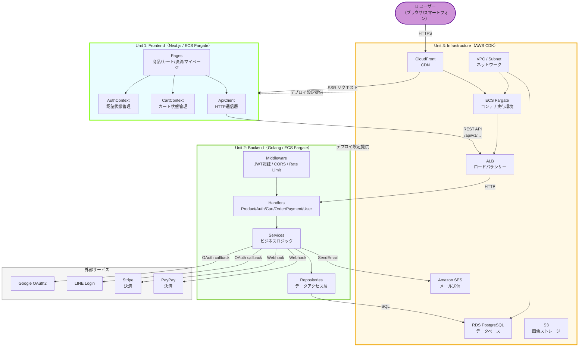
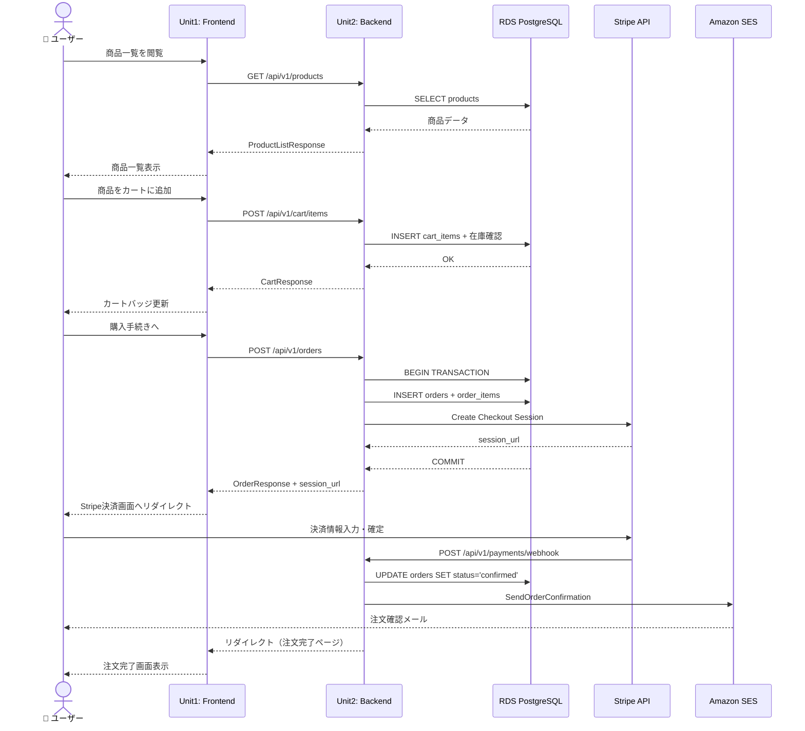
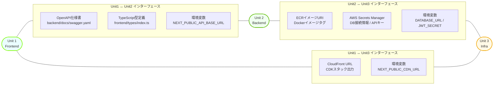

# コンテキストマップ

ユニット間のデータフローと依存関係を可視化します。

---

## 1. システム全体コンテキストマップ



---

## 2. データフロー詳細マップ（購入フロー）



---

## 3. ユニット間インターフェース定義



---

## 4. ユニット間依存関係サマリー

| 依存元 | 依存先 | 依存種別 | インターフェース |
|--------|--------|---------|----------------|
| Unit 1 Frontend | Unit 2 Backend | 実行時（Runtime） | REST API（OpenAPI仕様） |
| Unit 1 Frontend | Unit 3 Infrastructure | デプロイ時（Deploy） | CloudFront URL、ECS設定 |
| Unit 2 Backend | Unit 3 Infrastructure | デプロイ時（Deploy） | ECS設定、RDS接続情報、Secrets Manager |
| Unit 2 Backend | Stripe | 実行時（Runtime） | Stripe SDK / Webhook |
| Unit 2 Backend | PayPay | 実行時（Runtime） | PayPay REST API / Webhook |
| Unit 2 Backend | Google OAuth | 実行時（Runtime） | OAuth2 Authorization Code Flow |
| Unit 2 Backend | LINE Login | 実行時（Runtime） | OAuth2 Authorization Code Flow |
| Unit 2 Backend | Amazon SES | 実行時（Runtime） | AWS SDK for Go |

---

## テキスト代替表現（Mermaid非対応環境向け）

```
システム全体構成:
  ユーザー
    → [HTTPS] → CloudFront (Unit3)
    → [SSR] → Next.js Frontend (Unit1)
    → [REST API] → ALB (Unit3)
    → [HTTP] → Golang Backend (Unit2)
    → [SQL] → RDS PostgreSQL (Unit3)

外部サービス連携 (Unit2から):
  → Google OAuth2 (認証)
  → LINE Login (認証)
  → Stripe (決済)
  → PayPay (決済)
  → Amazon SES (メール)

ユニット間依存:
  Unit1 --実行時依存--> Unit2 (REST API)
  Unit1 --デプロイ依存--> Unit3 (CloudFront/ECS)
  Unit2 --デプロイ依存--> Unit3 (ECS/RDS/ALB)
```
