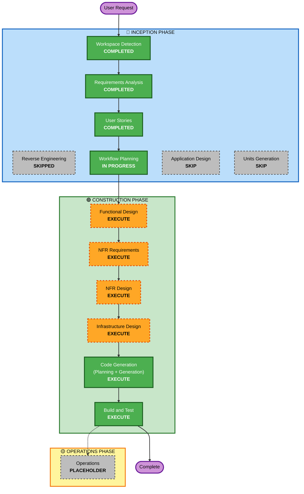

# Execution Plan

## 詳細分析サマリー

### プロジェクト種別
- **Project Type**: Greenfield（新規）
- **構成**: 単一フロントエンド（Next.js SSG） + AWS S3 静的ホスティング
- **バックエンド/DB**: なし

### Change Impact Assessment
| 影響領域 | 影響有無 | 説明 |
|---------|---------|------|
| User-facing changes | Yes | 訪問者向けの完全新規ページ（コンテンツ表示・テーマ切替・多言語・アニメーション） |
| Structural changes | Yes | 新規プロジェクト構造（Next.js App Router） |
| Data model changes | No | データベースなし。コード内設定ファイル（TS定数/JSON）で管理 |
| API changes | No | バックエンドAPIなし |
| NFR impact | Yes | Lighthouse 90+、WCAG AA、SSG、S3デプロイ |

### Risk Assessment
- **Risk Level**: Low
- **Rollback Complexity**: Easy（静的ファイル差し替え／Gitリバート）
- **Testing Complexity**: Simple-Moderate（コンポーネントテスト + 純粋関数のPBT）

---

## Workflow Visualization



### テキスト代替（Mermaid失敗時のフォールバック）
```
Phase 1: INCEPTION
- Workspace Detection           [COMPLETED]
- Reverse Engineering           [SKIPPED - Greenfield]
- Requirements Analysis         [COMPLETED]
- User Stories                  [COMPLETED]
- Workflow Planning             [IN PROGRESS]
- Application Design            [SKIP]
- Units Generation              [SKIP]

Phase 2: CONSTRUCTION（単一ユニット: Frontend）
- Functional Design             [EXECUTE]
- NFR Requirements              [EXECUTE]
- NFR Design                    [EXECUTE]
- Infrastructure Design         [EXECUTE]
- Code Generation               [EXECUTE - ALWAYS]
- Build and Test                [EXECUTE - ALWAYS]

Phase 3: OPERATIONS
- Operations                    [PLACEHOLDER]
```

---

## Phases to Execute

### 🔵 INCEPTION PHASE
- [x] Workspace Detection — COMPLETED
- [x] Reverse Engineering — SKIPPED（Greenfield）
- [x] Requirements Analysis — COMPLETED
- [x] User Stories — COMPLETED
- [x] Workflow Planning — IN PROGRESS
- [ ] Application Design — **SKIP**
  - **Rationale**: 単一フロントエンドのみで、サービス層やバックエンドコンポーネント設計が不要。コンポーネント設計は Functional Design でカバー可能。
- [ ] Units Generation — **SKIP**
  - **Rationale**: フロントエンド単一ユニット構成のため、ユニット分解は不要。

### 🟢 CONSTRUCTION PHASE — 単一ユニット: Frontend
- [ ] Functional Design — **EXECUTE**
  - **Rationale**: ドメインモデル（Profile / Skill / Theme / Locale / GalleryImage 等）とコンポーネント階層の明文化が必要。
- [ ] NFR Requirements — **EXECUTE**
  - **Rationale**: Lighthouse 90+、WCAG AA、SSG、S3デプロイなど明確なNFRがあり、技術スタックの最終決定が必要。
- [ ] NFR Design — **EXECUTE**
  - **Rationale**: テーマ切替（CSS Variables）、i18n、アクセシビリティ、パフォーマンス最適化のパターン設計が必要。
- [ ] Infrastructure Design — **EXECUTE**
  - **Rationale**: AWS S3 静的Webサイトホスティングの構成設計（バケット設定、CloudFront 任意検討、デプロイフロー）が必要。
- [ ] Code Generation — **EXECUTE**（ALWAYS）
  - **Rationale**: 実装計画＋コード生成。
- [ ] Build and Test — **EXECUTE**（ALWAYS）
  - **Rationale**: ビルド・ユニットテスト・PBT（純粋関数）の実行。

### 🟡 OPERATIONS PHASE
- [ ] Operations — PLACEHOLDER
  - **Rationale**: 将来の拡張用プレースホルダ。

---

## Estimated Timeline
- **実行ステージ数**: 9（うち INCEPTION 5 完了済み、残り CONSTRUCTION 6）
- **ユニット数**: 1（Frontend単一）

## Success Criteria
- **Primary Goal**: PCで通常Webレイアウト・スマホで名刺レイアウトの自己紹介ページを構築し、AWS S3 にデプロイ可能な静的ファイルを生成する。
- **Key Deliverables**:
  - Next.js 14 SSG プロジェクトコード一式
  - 4色テーマ切替＋日英切替動作
  - 写真ギャラリー（メイン＋サブ3枚）
  - レスポンシブ（PC通常 / スマホ名刺）
  - 静的ビルド成果物（`out/` 配下）
- **Quality Gates**:
  - Lighthouse Performance ≧ 90
  - WCAG 2.1 AA 準拠（全テーマでコントラスト確認）
  - 全ストーリーの受け入れ基準を満たす
  - PBT（純粋関数）パス
